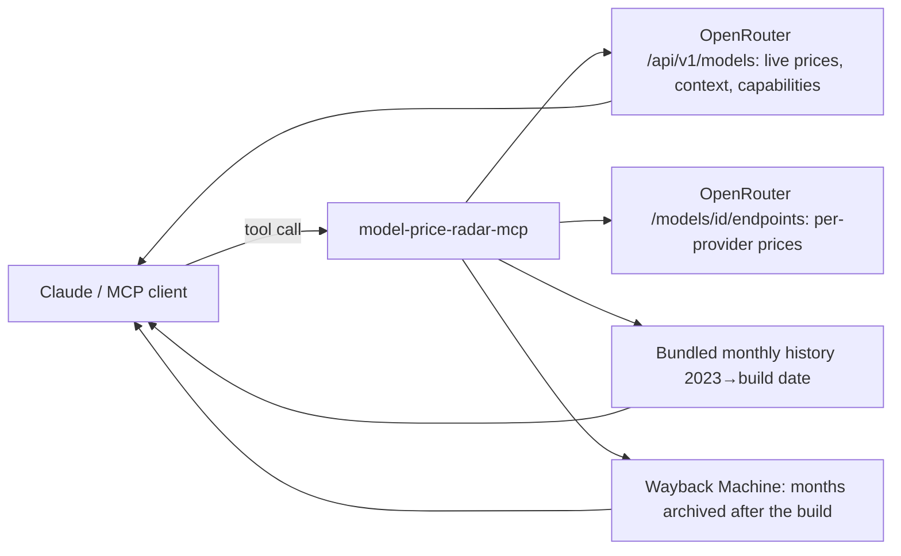

# model-price-radar-mcp

<!-- mcp-name: io.github.alialtunar/model-price-radar-mcp -->

**What does each LLM cost today, and did it get cheaper?** An MCP server over OpenRouter's public model catalog (~450 models) **plus monthly price history since 2023**, rebuilt from Wayback Machine copies of the catalog. Ask Claude (or any MCP client) for the cheapest model that can do a job, what a workload will cost, or how a model's price moved.

No API keys. One line to install.

```
You:    Did LLM prices really go down? Show me GPT-4o and DeepSeek Chat.
Claude: [model_price_history ×2, price_changes]
        • GPT-4o: $5 / $15 per 1M tokens until Oct 2024, $2.50 / $10 since Nov 2024.
        • DeepSeek Chat changed price 12 times since mid-2024; input went from
          $0.14 to $0.26 per 1M.
        • Not everything gets cheaper: since Oct 2025 older open models went up
          as cheap hosts dropped them, e.g. Qwen 2.5 Coder 32B input $0.04 → $0.66.
```
<sub>Summarized from real tool output, 1 Oct 2026.</sub>


## Why

| You want to know | Without it | With model-price-radar |
|---|---|---|
| Cheapest model with tools + vision + 200k context | Scroll pricing pages | `find_models(needs=["tools","vision"], min_context=200000)` |
| What 100k calls/month will cost on 5 models | Spreadsheet | `estimate_cost` ranks them with a "× cheapest" column |
| Did this model's price change? | Nobody keeps history | `model_price_history` since the model appeared |
| What moved in LLM pricing this quarter | Twitter | `price_changes` lists drops, increases, newly free models |
| Which provider serves Llama cheapest | Compare tabs | `compare_providers` with quantization and uptime |

## How it works



Price history ships inside the package (18 KB, one snapshot per month since July 2023), so history answers are instant; months archived after the release are fetched from the Wayback Machine on demand and cached. Prices are US$ per 1M tokens; "blended" assumes 3 input tokens per output token.

## Install

Requires [uv](https://docs.astral.sh/uv/).

**Claude Code**
```bash
claude mcp add model-price-radar -- uvx model-price-radar-mcp
```

**Claude Desktop / Cursor** (`claude_desktop_config.json` / `.cursor/mcp.json`)
```json
{
  "mcpServers": {
    "model-price-radar": {
      "command": "uvx",
      "args": ["model-price-radar-mcp"]
    }
  }
}
```

## Tools

| Tool | What it does |
|---|---|
| `find_models` | Search the live catalog by name, capabilities (tools, vision, reasoning, structured outputs, audio, free), price ceilings, context |
| `estimate_cost` | Cost of a workload (tokens per call × calls) on up to 10 models, cheapest first |
| `model_price_history` | Every price change of one model since it appeared, with % changes |
| `price_changes` | Since a month: biggest drops and increases, newly free models, models added/removed |
| `compare_providers` | Same model across providers: price, context, max output, quantization, uptime |

Model names are forgiving: `"claude sonnet"` resolves to the newest Sonnet, `"llama 3.1 70b"` to `meta-llama/llama-3.1-70b-instruct`.

**Prompts:** `cheapest_model_for` (a task → recommended model with monthly cost), `monthly_price_report`.

## Try these

- "Cheapest model with tool calling and vision for 50k support tickets a day? Show monthly cost."
- "How did Claude and GPT prices change since 2024?"
- "What got cheaper in LLM pricing since January?"
- "Which provider serves Llama 4 Maverick cheapest, and at what quantization?"

## Limits

- Prices are OpenRouter's, which usually equal each provider's list price. Batch and enterprise discounts are not included.
- History has one point per archived month, so a change is dated "between these two months".
- Models are tracked by OpenRouter id; a renamed id starts a new history.

## Part of the keyless MCP series

Open-source MCP servers that answer one market question each, with public data and no API keys.

| Server | Question it answers |
|---|---|
| [review-miner-mcp](https://github.com/alialtunar/review-miner-mcp) | What do users hate about competitor apps and games? (App Store + Steam reviews) |
| [pricing-time-machine-mcp](https://github.com/alialtunar/pricing-time-machine-mcp) | How did a SaaS pricing page change over the years? (Wayback Machine) |
| [hn-hiring-trends-mcp](https://github.com/alialtunar/hn-hiring-trends-mcp) | Which skills are tech companies hiring for, and which are rising? (HN Who is hiring) |
| **model-price-radar-mcp** (this one) | What does each LLM cost, and did it get cheaper? (OpenRouter + price history) |
| [launch-detector-mcp](https://github.com/alialtunar/launch-detector-mcp) | What is a company about to launch? (certificate transparency logs) |

## Development

```bash
uv sync --extra dev
uv run pytest                              # offline tests with mocked OpenRouter + Wayback
uv run python scripts/smoke_live.py        # live check
uv run python scripts/build_history.py     # rebuild the bundled history (several minutes)
uv run --with rich python scripts/demo.py deepseek/deepseek-chat   # terminal demo (vhs docs/demo.tape records the GIF)
```

MIT © Ali Altunar
